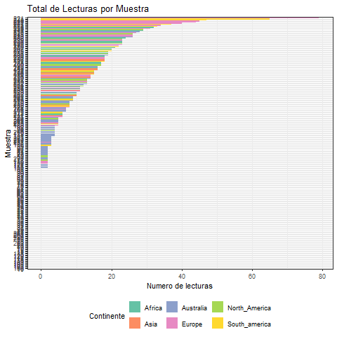

```{r setup, include=FALSE}
knitr::opts_chunk$set(echo = TRUE)
```

# Proyecto genómica funcional

```{r echo=TRUE}
# Le pedimos a la IA que nos diera código para poner dos imágenes juntas en el mismo renglón
```

```{r}
# Preparar el entorno. Asegurate que tienes instalados estos paquetes antes de correr el código.

library(dada2)
library(phyloseq)
library(ggplot2)
library(igraph)
library(corrr)
library(ggraph)
library(tidygraph)

```


Seguimos un pipeline de DADA2 para obtener la asignación taxonómica de hongos y bacterias, con datos de secuenciación (ITS2 y 16S, respectivamente):

Quality profile -> Filter and Trim -> Learn Errors -> dada (Divisive Amplicon Denoising Algorithm) -> Merge pairs -> Remove Bimera -> Assign Taxonomy

Analizamos 275 muestras de bacterias, y 275 muestras de hongos, con millones de lecturas en total.

Para bacterias, estos fueron nuestros perfiles de calidad:

<div style= "display: flex; gap: 10px;">


</div>

Y estos fueron los de hongos: 

<div style= "display: flex; gap: 10px;">


</div>

Después de filtrar las secuencias, el algoritmo de machine learning genera un modelo de error basado en los datos (learnErrors). La calidad del modelo se observa con plotErrors, donde los puntos son las tasas de error observadas, y la línea negra es el error estimado por el modelo, deben estar muy cercanos los puntos a esta línea. La línea roja son las tasas de error esperadas con cada Phred score.

En bacterias:

<div style= "display: flex; gap: 10px;">


</div>

Y en hongos:

<div style= "display: flex; gap: 10px;">


</div>

Seguimos adelante con la asignación taxonómica de bacterias, pero por cuestiones de tiempo, no hicimos asignación de hongos. A partir de aquí todos los resultados son exclusivamente de bacterias.

```{r include=FALSE}
taxa.print_b <- readRDS("taxa.print_bacteria.RDS")
```
Ya que obtuvimos la asignación final, revisamos si se logró asignar hasta nivel de especie, y no se pudo:

```{r}
taxa.print_b[,7]
```

Pero varios sí llegaron a nivel de género:

```{r}
taxa.print_b[90:100, 1:6]
```

```{r}
genero <- taxa.print_b[,6] # Selecciona solo la columna de genero
genero <- genero[!is.na(genero)] # Borra todas las NA
genero <- unique(genero) # Elimina los repetidos
```
Estos fueron los géneros encontrados:
```{r}
print (genero)
```

A partir de los datos generados por DADA2, creamos un objeto phyloseq para hacer el filtrado de ASVs:

```{r include=FALSE}
ps <- readRDS("C:/Users/anabe/Documents/mariana/genomica/Proyecto_Genomica/03_Results/ps.RDS") # Hay que darle la ruta completa. Esto solo funciona en mi computadora y debe reemplazarse para hacerlo en otra.
```
```{r}
print (ps)
```

Posteriormente analizamos la distribución de las lecturas:

```{r include=FALSE}
sample_sums_vec <- sample_sums(ps) # esto nos permite identificar como se distribuyen las lecturas en cada muestra
```
```{r}
summary(sample_sums_vec)
```
* Min 0: indica que hubo al menos una muestra con 0 lecturas
* 1st Qu. 0: indica que hasta el primer cuartil (25%), ninguna muestra tenía lecturas
* Median (2nd Qu) 3: indica que hasta el segundo cuartil (50%), las muestras tienen máximo 3 lecturas
* 3rd Qu 13: indica que hasta el tercer cuartil (75%), las muestras tienen máximo 13 lecturas.
* Max 79: indica que hubo al menos una muestra con 79 lecturas, y ninguna muestra tuvo más
* Mean 8: en promedio las muestras tuvieron 8 lecturas, lo cual es muy malo, porque inicialmente se tenían más de 100 millones de lecturas. 

Se perdió mucha información al momento de hacer la asignación taxonómica, probablemente por usar parámetros demasiado estrictos.




```{r}
sum (sample_sums_vec)
```
Nosotros nos quedamos con 1907 lecturas. Y el autor original se quedó con 6,278,448 lecturas en este paso.

```{r}
ntaxa(ps) 
```
Al final de la asignación obtuvimos 731 ASV (el autor original se quedó con 60,538 ASV de bacterias)

Puesto que la cantidad de ASV que obtuvimos fue muy poca, no realizamos el filtrado estricto  que se usa en el artículo original, si no que usamos uno más permisivo para no perder tantos ASVs:

* Se eliminaron los ASV con solo 1 lectura.
* No se hizo filtrado por prevalencia en los continentes (el artículo original usó 25%)

```{r include=FALSE}
ps_filtered <- prune_taxa(taxa_sums(ps) > 1, ps) # Borra los ASVs con 1 lectura

cat("ASVs originales:", ntaxa(ps), "\n")
cat("ASVs tras filtrado:", ntaxa(ps_filtered), "\n")
cat("ASVs removidos:", ntaxa(ps) - ntaxa(ps_filtered), "\n")

```

Con estos datos, procedimos a generar la red y hacer los análisis correspondientes.

## Conclusiones

### Respecto a los resultados

* Es importante verificar el efecto que tienen los parámetros en cada paso del proyecto, para poder corregirlos.
* Comprender la teoría detrás del código es importante, pero es necesario practicar en casos hipotéticos o reales para conseguir mejores resultados.

### Extrapolable a otros proyectos

-   La literatura en bioinformática carece de metologías bien descritas que permitan una reproducción adecuada de los resultados.
-   Al trabajar con metodologías tardadas, en trabajos colaborativos o que involucren el uso de distintas computadoras para el mismo proyecto, es recomendable generar "checkpoints"durante todo el proceso, para facilitar el trabajo y evitar repetir pasos.
