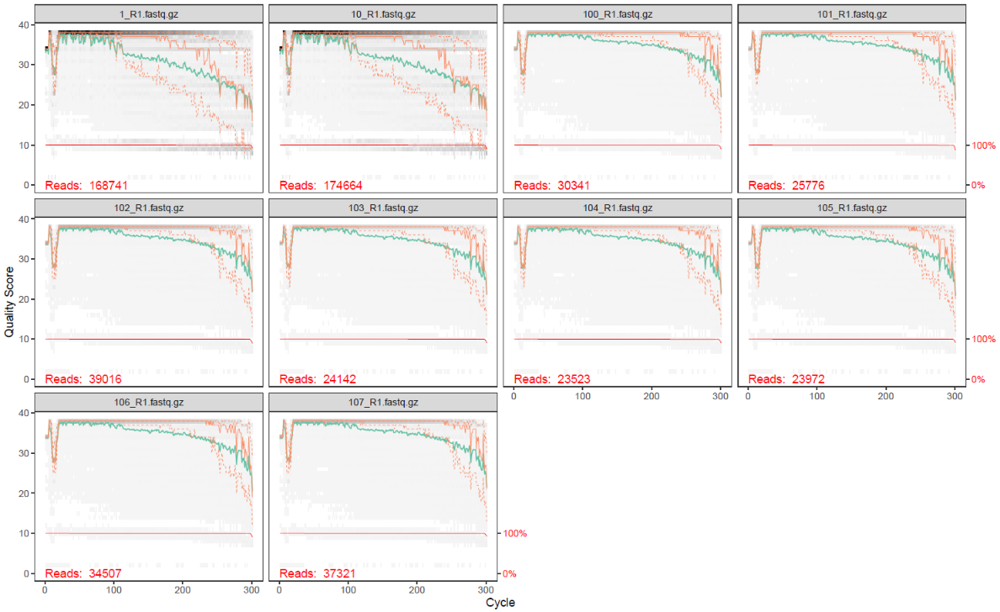
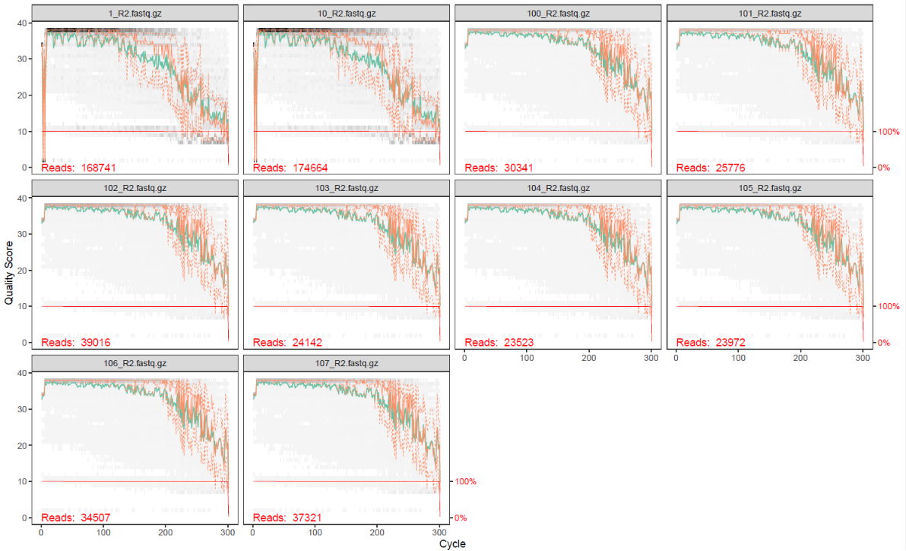
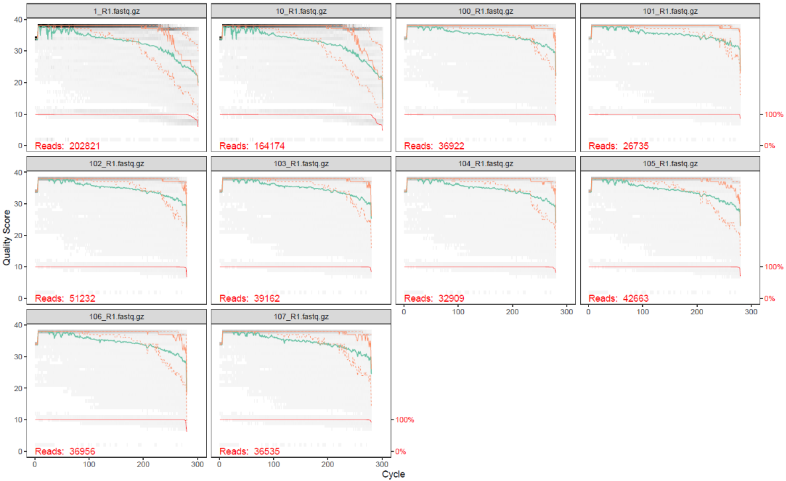
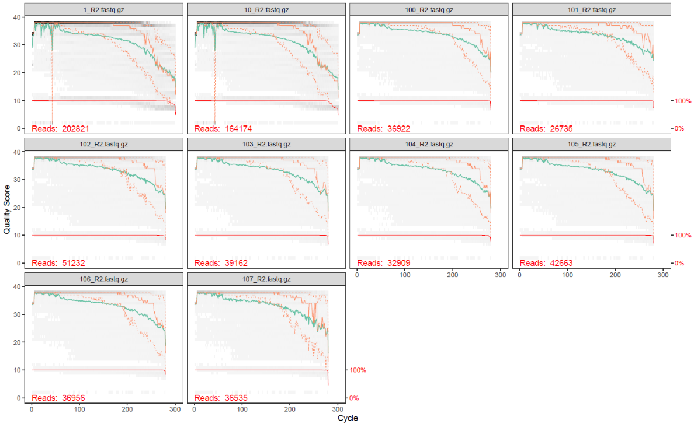
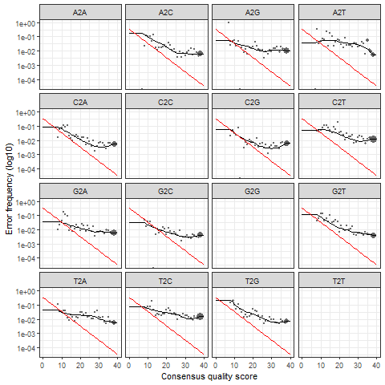

```{r setup, include=FALSE}
knitr::opts_chunk$set(echo = TRUE)
```

# Proyecto genómica funcional

```{r echo=TRUE}
# Le pedimos a la IA que nos diera código para poner dos imágenes juntas en el mismo renglón
```

<div style= "display: flex; gap: 10px;">


</div>


<div style= "display: flex; gap: 10px;">


</div>

<div style= "display: flex; gap: 10px;">


</div>

<div style= "display: flex; gap: 10px;">


</div>


```{r include=FALSE}
taxa.print_b <- readRDS("taxa.print_bacteria.RDS")
```
Revisamos si se logró asignar hasta nivel de especie, y no se pudo
```{r}
taxa.print_b[,7]
```
Pero varios sí llegaron a nivel de género

```{r}
taxa.print_b[90:100, 1:6]
```


## Conclusiones

### Respecto a los resultados

### Extrapolable a otros proyectos

-   La literatura en bioinformática carece de metologías bien descritas que permitan una reproducción adecuada de los resultados.
-   Al trabajar con metodologías tardadas, en trabajos colaborativos o que involucren el uso de distintas computadoras para el mismo proyecto, es recomendable generar "checkpoints"durante todo el proceso, para facilitar el trabajo y evitar repetir pasos.
